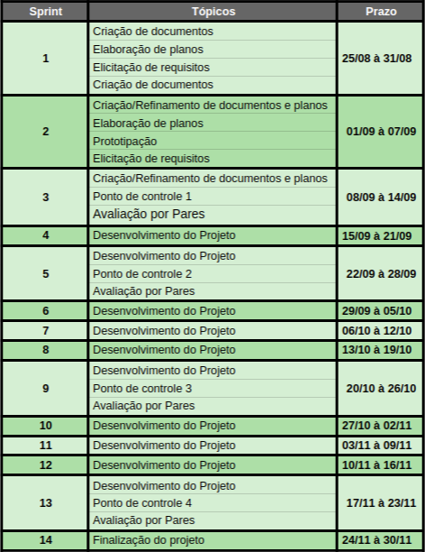

# Cronograma

### Histórico de revisão

Data | Versão | Descrição | Autor |
--------- | ------ | ------------ | --------- |
10/09/2020 | 0.1 | Elaboração da pagina inicial | Fernando Aguilar, Ricardo Canela, |

## Introdução

Este documento foi desenvolvido para a disciplina de Desenho e Arquitetura de Software, da Universidade de Brasília.

O objetivo deste documento é apresentar um cronograma no qual o grupo seguirá para realizar as atividades do desenvolvimento do projeto.

O gerenciamento do cronograma aborda os processos de planejar o gerenciamento do cronograma, definir as atividades, sequenciar as atividades, estimar a duração das atividades.

## Metodologia

O documento será dividido em tópicos que representam os processos de gerenciamento do cronograma  para o projeto.

- **Planejar o Gerenciamento do Cronograma:** Serão estabelecidos os processos de políticas, procedimentos, documentação para o planejamento, desenvolvimento, gerenciamento, execução e controle do cronograma do projeto.

- **Definir as Atividades:** As tarefas serão identificadas e documentadas para produzir as entregas do projeto.

- **Sequenciar as Atividades:** Processo de identificar e documentar os relacionamentos entre as atividades do projeto.

- **Estimar as Durações das Atividades:** Estimar o tempo de trabalho necessário para terminar atividades individuais com os recursos estimados

- **Desenvolver o Cronograma:** analisar as sequências de atividades, durações, requisitos de recursos e restrições de cronograma para criar o modelo de cronograma do projeto para execução, monitoramento e controle do mesmo.

- **Controlar o Cronograma:** O processo de monitorar o status do projeto para atualizar o cronograma do projeto e gerenciar mudanças na linha de base do mesmo.

## Desenvolvimento

### Versão 1.0

### Planejar o Gerenciamento do Cronograma

O escopo do Projeto é definido a partir do cronograma estipulado pela disciplina de arquitetura e desenho de software, A partir das atividades determinadas pelo cronograma da matéria será possível elaborar um cronograma para o projeto.

### Definir as Atividades:

A partir da definição do escopo do projeto é possível dividi-lo em entregas menores, mais fáceis de gerenciar, assim determinar tarefas(atividades) para concluir,desenvolver, cada parte do escopo

### Sequenciar as Atividades:

As tarefas serão sequenciadas a partir dos módulos do escopo, definidos na disciplina, com nível de hierarquia de importância e dependência entre as atividades.

### Estimar as Durações das Atividades:

As durações das atividades serão definidas em reuniões de planejamento com a equipe, com critérios específicos como: complexidade da atividade, capacidade de entrega da equipe e duração de um ciclo de entrega (Sprint).

### Desenvolver o Cronograma

Com atividades definidas para cada módulo do escopo é possível elaborar um cronograma sequencial,de acordo com as datas de entregas da disciplina, e com a metodologia que será utilizada pela equipe durante o projeto.

#### Cronograma estipulado:

