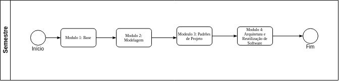
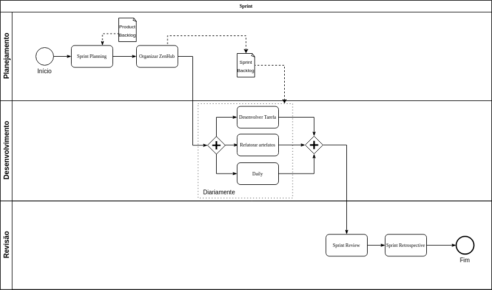

# Metodologia
### Histórico de revisão
Data | Versão | Descrição | Autor |
--------- | ------ | ------------ | --------- |
11/09/2020 | 0.1 | Criação do documento | Ricardo Lima Canela, Fernando Aguilar  |

## Introdução
O diagrama BPMN tem o objetivo de criar um padrão, uma linguagem comum para modelagem de processos da metologia da equipe, permitindo melhor ilustração e comunicação de todo processo

## Metodologia
O diagrama BPMN foi modelado de acordo com os processos metodologicos definidos pela equipe . A equipe utilizou o template de BPMN do lucidchart para elaboração do diagrama metodológico.

## Diagrama BPMN v1

## Diagrama da Disciplina

  

## Diagrama da Sprint

  
