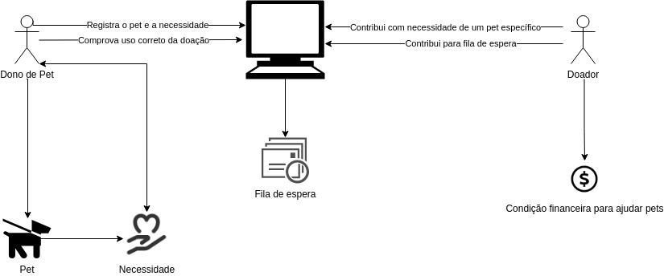

# Rich Picture
### Histórico de revisão
Data | Versão | Descrição | Autor |
--------- | ------ | ------------ | --------- |
09/09/2020 | 0.1 | Criação do documento | Ricardo Lima Canela, Fernando Aguilar |

## Introdução
O Rich Picture é um artefato usado para entender de forma visual, o fluxo e a complexidade de uma situação. Geralmente usado na fase de pré-rastreabilidade para analisar problemas e expressar ideias.

## Objetivo
A finalidade para o uso do RicPicture é fornecer um modelo que auxilia o entendimento e definição de uma situação ou escopo para trazer uma visão mais ampla do cenário que será analisado para o levantamento de requisitos.

## Rich Picture
A finalidade do uso do Rich Picture é fornecer um modelo que auxilia o entendimento e definição de uma situação ou escopo para trazer uma visão mais ampla do cenário que será analisado para o levantamento de requisitos.
### Aplicação
#### Versão 0.1
  
Autores: Ricardo Canela e Ramon Sales 