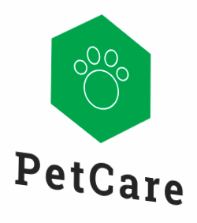

## Arquitetura e Desenho de Software 2020-1

### Sobre
PetCare tem como propósito ajudar os Pets necessitados a terem uma melhor saúde e qualidade de vida.  

### Ambiente de Desenvolvimento
Para executar o ambiente de desenvolvimento, acesse o guia #TODO 

### Colaboradores
Informações dos colaboradores:

| Nome | Matrícula | GitHub |
| --- | --- | --- |
| Ricardo Lima Canela | 13/0132233 | [ricardocanela](https://github.com/ricardocanela) |
| Ramon Silva Sales | 14/0160205 | [ramonsales](https://github.com/ramonsales) |
| Fernando Ribeiro Aguiar | 14/0139281 | [fernand0aguilar](https://github.com/fernand0aguilar) |

### Contribuir
Para contribuir, o colaborador deve ler o código de conduta #TODO, dar um _fork_ e enviar um [pull request](https://github.com/UnBArqDsw/2020.1_G14_PetCare/pulls) com sua contribuição.
O código será analisado por um dos proprietários do projeto e, se aprovado, incluído no núcleo da aplicação.
