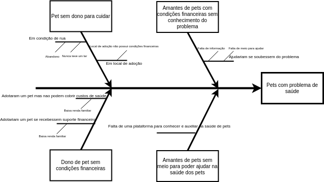

# Diagrama de Causa e Efeito 
### Histórico de revisão
Data | Versão | Descrição | Autor |
--------- | ------ | ------------ | --------- |
09/09/2020 | 0.1 | Criação do documento | Ricardo Lima Canela |

## 1. Introdução
O Diagrama de Ishikawa, também conhecido como Diagrama de Espinha de Peixe ou Diagrama de Causa e Efeito, é uma ferramenta da qualidade que ajuda a levantar as causas-raízes de um problema, analisando todos os fatores que envolvem a execução do processo.

## 2. Objetivo
Este documento tem como objetivo mostrar algumas das principais causas para falta de saúde de Pets utilizando o Diagrama de Causa-Efeito.

## 3. Diagrama de Causa e Efeito

Autores: Ricardo Lima Canela

## 4. Referências
* O QUE É E COMO FAZER UM DIAGRAMA DE ISHIKAWA? Disponível em: <https://www.siteware.com.br/metodologias/diagrama-de-ishikawa>. Acesso em: 09/09/2020.
* Diagrama de Ishikawa. Disponível em: <https://blogdaqualidade.com.br/diagrama-de-ishikawa>. Acesso em: 09/09/2020.
